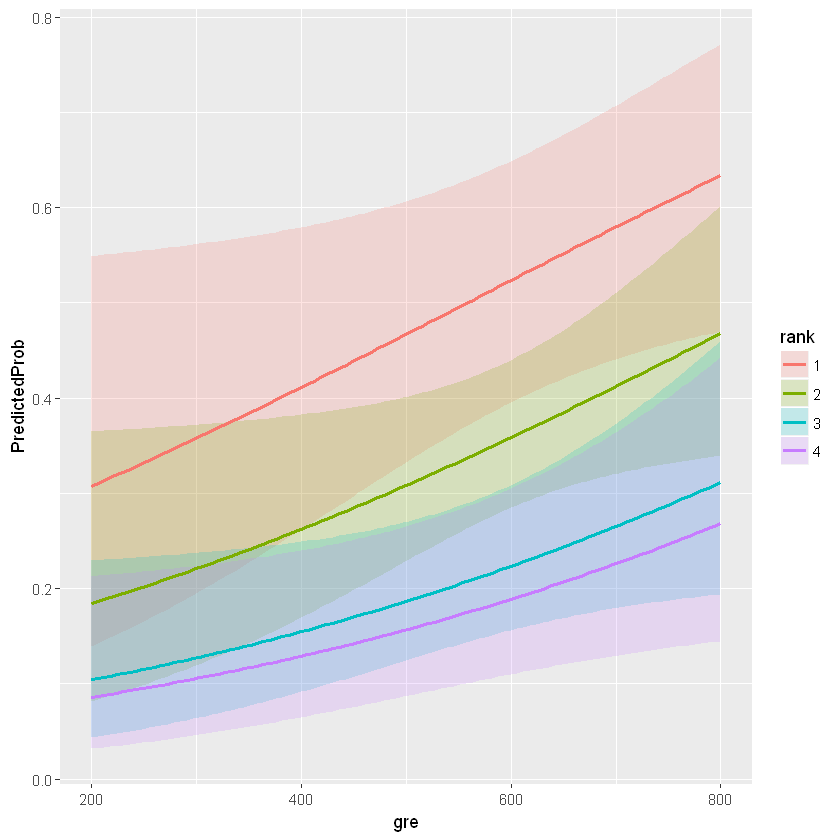

# Ejemplo Modelos Logit y Probit

## Datos usados

Se va a analizar el efecto que puede tener en el proceso de admisión a un curso de posgrado variables como el prestigio del centro educativo de pregrado (rank), el promedio académico (gpa) y la puntuación en el examen de graduación (gre). Los datos son tomados de https://stats.idre.ucla.edu

Para la estimación de los modelos se emplearán las librerías aod (para algunos test) y ggplot2 (gráficas):


```R
library(aod)
library(ggplot2)
```

Vamos a importar los datos:


```R
mydata <- read.csv("https://stats.idre.ucla.edu/stat/data/binary.csv")
head(mydata)
```


<table>
<thead><tr><th scope=col>admit</th><th scope=col>gre</th><th scope=col>gpa</th><th scope=col>rank</th></tr></thead>
<tbody>
	<tr><td>0   </td><td>380 </td><td>3.61</td><td>3   </td></tr>
	<tr><td>1   </td><td>660 </td><td>3.67</td><td>3   </td></tr>
	<tr><td>1   </td><td>800 </td><td>4.00</td><td>1   </td></tr>
	<tr><td>1   </td><td>640 </td><td>3.19</td><td>4   </td></tr>
	<tr><td>0   </td><td>520 </td><td>2.93</td><td>4   </td></tr>
	<tr><td>1   </td><td>760 </td><td>3.00</td><td>2   </td></tr>
</tbody>
</table>


La variable 'admit' es la variable respuesta. Como se observa es binaria. La variable 'rank' es una variable categórica de 4 niveles. El resumen numérico de los datos es el siguiente:


```R
summary(mydata)
```


         admit             gre             gpa             rank      
     Min.   :0.0000   Min.   :220.0   Min.   :2.260   Min.   :1.000  
     1st Qu.:0.0000   1st Qu.:520.0   1st Qu.:3.130   1st Qu.:2.000  
     Median :0.0000   Median :580.0   Median :3.395   Median :2.000  
     Mean   :0.3175   Mean   :587.7   Mean   :3.390   Mean   :2.485  
     3rd Qu.:1.0000   3rd Qu.:660.0   3rd Qu.:3.670   3rd Qu.:3.000  
     Max.   :1.0000   Max.   :800.0   Max.   :4.000   Max.   :4.000  


Podemos calcular, también, la desviación estándar para cada variable (ya se discutirá la pertinencia o no de hacerlo para variables categóricas):


```R
sapply(mydata, sd)
```


<dl class=dl-horizontal>
	<dt>admit</dt>
		<dd>0.466086732384932</dd>
	<dt>gre</dt>
		<dd>115.516536372238</dd>
	<dt>gpa</dt>
		<dd>0.380566771630384</dd>
	<dt>rank</dt>
		<dd>0.944460169902007</dd>
</dl>


Como la variable 'rank' es categórica, lo conveniente es construir una tabla de contingencia de doble entrada para analizar frecuencias:


```R
xtabs(~admit + rank, data = mydata)
```


         rank
    admit  1  2  3  4
        0 28 97 93 55
        1 33 54 28 12


## Modelo Logit


```R
mydata$rank <- factor(mydata$rank)
mylogit <- glm(admit ~ gre + gpa + rank, data = mydata, family = "binomial")
summary(mylogit)
```


    
    Call:
    glm(formula = admit ~ gre + gpa + rank, family = "binomial", 
        data = mydata)
    
    Deviance Residuals: 
        Min       1Q   Median       3Q      Max  
    -1.6268  -0.8662  -0.6388   1.1490   2.0790  
    
    Coefficients:
                 Estimate Std. Error z value Pr(>|z|)    
    (Intercept) -3.989979   1.139951  -3.500 0.000465 ***
    gre          0.002264   0.001094   2.070 0.038465 *  
    gpa          0.804038   0.331819   2.423 0.015388 *  
    rank2       -0.675443   0.316490  -2.134 0.032829 *  
    rank3       -1.340204   0.345306  -3.881 0.000104 ***
    rank4       -1.551464   0.417832  -3.713 0.000205 ***
    ---
    Signif. codes:  0 '***' 0.001 '**' 0.01 '*' 0.05 '.' 0.1 ' ' 1
    
    (Dispersion parameter for binomial family taken to be 1)
    
        Null deviance: 499.98  on 399  degrees of freedom
    Residual deviance: 458.52  on 394  degrees of freedom
    AIC: 470.52
    
    Number of Fisher Scoring iterations: 4
    


```R
confint(mylogit)
```

    Waiting for profiling to be done...
    


<table>
<thead><tr><th></th><th scope=col>2.5 %</th><th scope=col>97.5 %</th></tr></thead>
<tbody>
	<tr><th scope=row>(Intercept)</th><td>-6.2716202334</td><td>-1.792547080 </td></tr>
	<tr><th scope=row>gre</th><td> 0.0001375921</td><td> 0.004435874 </td></tr>
	<tr><th scope=row>gpa</th><td> 0.1602959439</td><td> 1.464142727 </td></tr>
	<tr><th scope=row>rank2</th><td>-1.3008888002</td><td>-0.056745722 </td></tr>
	<tr><th scope=row>rank3</th><td>-2.0276713127</td><td>-0.670372346 </td></tr>
	<tr><th scope=row>rank4</th><td>-2.4000265384</td><td>-0.753542605 </td></tr>
</tbody>
</table>


```R
confint.default(mylogit)
```


<table>
<thead><tr><th></th><th scope=col>2.5 %</th><th scope=col>97.5 %</th></tr></thead>
<tbody>
	<tr><th scope=row>(Intercept)</th><td>-6.2242418514</td><td>-1.755716295 </td></tr>
	<tr><th scope=row>gre</th><td> 0.0001202298</td><td> 0.004408622 </td></tr>
	<tr><th scope=row>gpa</th><td> 0.1536836760</td><td> 1.454391423 </td></tr>
	<tr><th scope=row>rank2</th><td>-1.2957512650</td><td>-0.055134591 </td></tr>
	<tr><th scope=row>rank3</th><td>-2.0169920597</td><td>-0.663415773 </td></tr>
	<tr><th scope=row>rank4</th><td>-2.3703986294</td><td>-0.732528724 </td></tr>
</tbody>
</table>


```R
wald.test(b = coef(mylogit), Sigma = vcov(mylogit), Terms = 4:6)
```


    Wald test:
    ----------
    
    Chi-squared test:
    X2 = 20.9, df = 3, P(> X2) = 0.00011


```R
l <- cbind(0, 0, 0, 1, -1, 0)
wald.test(b = coef(mylogit), Sigma = vcov(mylogit), L = l)
```


    Wald test:
    ----------
    
    Chi-squared test:
    X2 = 5.5, df = 1, P(> X2) = 0.019


```R
exp(coef(mylogit))
```


<dl class=dl-horizontal>
	<dt>(Intercept)</dt>
		<dd>0.0185001012612635</dd>
	<dt>gre</dt>
		<dd>1.00226699153453</dd>
	<dt>gpa</dt>
		<dd>2.23454482427123</dd>
	<dt>rank2</dt>
		<dd>0.508930950928136</dd>
	<dt>rank3</dt>
		<dd>0.261792279380112</dd>
	<dt>rank4</dt>
		<dd>0.211937538610399</dd>
</dl>


```R
exp(cbind(OR = coef(mylogit), confint(mylogit)))
```

    Waiting for profiling to be done...
    


<table>
<thead><tr><th></th><th scope=col>OR</th><th scope=col>2.5 %</th><th scope=col>97.5 %</th></tr></thead>
<tbody>
	<tr><th scope=row>(Intercept)</th><td>0.0185001  </td><td>0.001889165</td><td>0.1665354  </td></tr>
	<tr><th scope=row>gre</th><td>1.0022670  </td><td>1.000137602</td><td>1.0044457  </td></tr>
	<tr><th scope=row>gpa</th><td>2.2345448  </td><td>1.173858216</td><td>4.3238349  </td></tr>
	<tr><th scope=row>rank2</th><td>0.5089310  </td><td>0.272289674</td><td>0.9448343  </td></tr>
	<tr><th scope=row>rank3</th><td>0.2617923  </td><td>0.131641717</td><td>0.5115181  </td></tr>
	<tr><th scope=row>rank4</th><td>0.2119375  </td><td>0.090715546</td><td>0.4706961  </td></tr>
</tbody>
</table>


```R
newdata1 <- with(mydata, data.frame(gre = mean(gre), gpa = mean(gpa), rank = factor(1:4)))
newdata1
```


<table>
<thead><tr><th scope=col>gre</th><th scope=col>gpa</th><th scope=col>rank</th></tr></thead>
<tbody>
	<tr><td>587.7 </td><td>3.3899</td><td>1     </td></tr>
	<tr><td>587.7 </td><td>3.3899</td><td>2     </td></tr>
	<tr><td>587.7 </td><td>3.3899</td><td>3     </td></tr>
	<tr><td>587.7 </td><td>3.3899</td><td>4     </td></tr>
</tbody>
</table>


```R
newdata1$rankP <- predict(mylogit, newdata = newdata1, type = "response")
newdata1
```


<table>
<thead><tr><th scope=col>gre</th><th scope=col>gpa</th><th scope=col>rank</th><th scope=col>rankP</th></tr></thead>
<tbody>
	<tr><td>587.7    </td><td>3.3899   </td><td>1        </td><td>0.5166016</td></tr>
	<tr><td>587.7    </td><td>3.3899   </td><td>2        </td><td>0.3522846</td></tr>
	<tr><td>587.7    </td><td>3.3899   </td><td>3        </td><td>0.2186120</td></tr>
	<tr><td>587.7    </td><td>3.3899   </td><td>4        </td><td>0.1846684</td></tr>
</tbody>
</table>


```R
newdata2 <- with(mydata, data.frame(gre = rep(seq(from = 200, to = 800, length.out = 100),
    4), gpa = mean(gpa), rank = factor(rep(1:4, each = 100))))
```


```R
newdata3 <- cbind(newdata2, predict(mylogit, newdata = newdata2, type = "link",
    se = TRUE))
newdata3 <- within(newdata3, {
    PredictedProb <- plogis(fit)
    LL <- plogis(fit - (1.96 * se.fit))
    UL <- plogis(fit + (1.96 * se.fit))
})
head(newdata3)
```


<table>
<thead><tr><th scope=col>gre</th><th scope=col>gpa</th><th scope=col>rank</th><th scope=col>fit</th><th scope=col>se.fit</th><th scope=col>residual.scale</th><th scope=col>UL</th><th scope=col>LL</th><th scope=col>PredictedProb</th></tr></thead>
<tbody>
	<tr><td>200.0000  </td><td>3.3899    </td><td>1         </td><td>-0.8114870</td><td>0.5147714 </td><td>1         </td><td>0.5492064 </td><td>0.1393812 </td><td>0.3075737 </td></tr>
	<tr><td>206.0606  </td><td>3.3899    </td><td>1         </td><td>-0.7977632</td><td>0.5090986 </td><td>1         </td><td>0.5498513 </td><td>0.1423880 </td><td>0.3105042 </td></tr>
	<tr><td>212.1212  </td><td>3.3899    </td><td>1         </td><td>-0.7840394</td><td>0.5034491 </td><td>1         </td><td>0.5505074 </td><td>0.1454429 </td><td>0.3134499 </td></tr>
	<tr><td>218.1818  </td><td>3.3899    </td><td>1         </td><td>-0.7703156</td><td>0.4978239 </td><td>1         </td><td>0.5511750 </td><td>0.1485460 </td><td>0.3164108 </td></tr>
	<tr><td>224.2424  </td><td>3.3899    </td><td>1         </td><td>-0.7565919</td><td>0.4922237 </td><td>1         </td><td>0.5518545 </td><td>0.1516973 </td><td>0.3193867 </td></tr>
	<tr><td>230.3030  </td><td>3.3899    </td><td>1         </td><td>-0.7428681</td><td>0.4866494 </td><td>1         </td><td>0.5525464 </td><td>0.1548966 </td><td>0.3223773 </td></tr>
</tbody>
</table>


```R
ggplot(newdata3, aes(x = gre, y = PredictedProb)) + geom_ribbon(aes(ymin = LL,
    ymax = UL, fill = rank), alpha = 0.2) + geom_line(aes(colour = rank),
    size = 1)
```





```R
with(mylogit, null.deviance - deviance)
```


41.4590250790164


```R
with(mylogit, df.null - df.residual)
```


5


```R
with(mylogit, pchisq(null.deviance - deviance, df.null - df.residual, lower.tail = FALSE))
```


7.57819423181525e-08


```R
logLik(mylogit)
```


    'log Lik.' -229.2587 (df=6)

