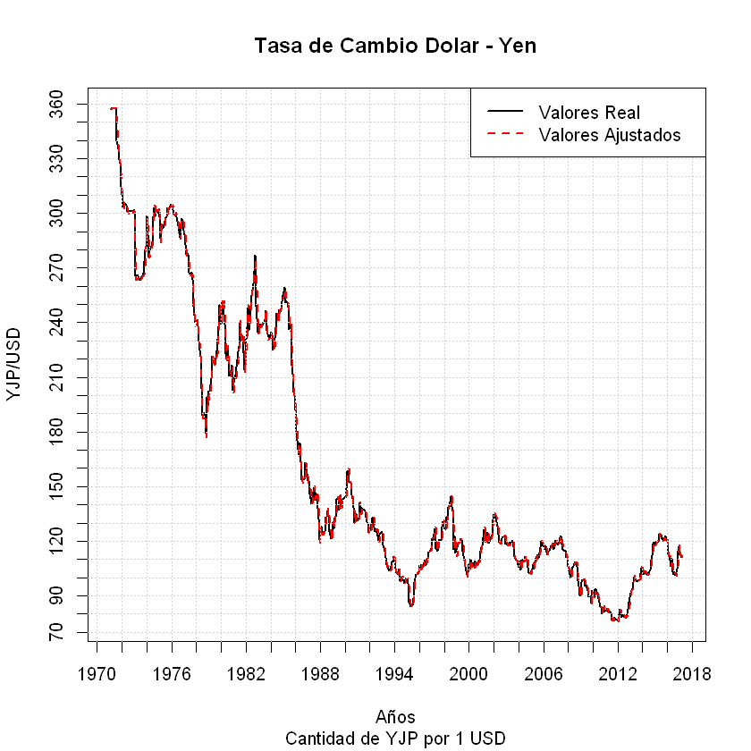

# ANÁLISIS DE SERIES DE TIEMPO

## Ejemplo Tasa de Cambio Yen - Dolar

Vamos a analizar la tasa de cambio Yen (JPN) - Dolar (USD), para ello, primero, requerimos algunas librerías. Recordemos que si el paquete no está instalado usamos la línea **install.packages()** para habilitarla.


```R
library("lattice")
library("plyr")
library("dplyr")
library("forecast")
library("hts")
library("phtt")
library("tseries")
library("TSA")
library("urca")
library("fArma")
library("HH")
library("ggplot2")
```

Traigamos, ahora, los datos. Podemos importarla desde un archivo de texto plano (bloc de notas), un archivo de excel o desde el portapapeles. Vamos a usar el portapapeles, dejando el último año de datos para la comprobación cruzada:


```R
yen<-read.delim('clipboard', header = T, dec = ','); head (yen)
```


<table>
<thead><tr><th scope=col>Fecha</th><th scope=col>Yen</th></tr></thead>
<tbody>
	<tr><td>feb-71</td><td>357.56</td></tr>
	<tr><td>mar-71</td><td>357.42</td></tr>
	<tr><td>abr-71</td><td>357.40</td></tr>
	<tr><td>may-71</td><td>357.40</td></tr>
	<tr><td>jun-71</td><td>357.40</td></tr>
	<tr><td>jul-71</td><td>357.39</td></tr>
</tbody>
</table>


Como observamos, la serie empieza en febrero de 1971. Ahora vamos a convertir los datos en serie:


```R
y<-ts(yen$Yen,start=c(1971,2),freq=12); y
```


            Jan    Feb    Mar    Apr    May    Jun    Jul    Aug    Sep    Oct
    1971        357.56 357.42 357.40 357.40 357.40 357.39 339.85 335.35 329.50
    1972 310.56 303.40 304.32 304.88 304.69 300.93 301.39 301.11 301.11 301.11
    1973 301.39 265.67 265.96 265.53 264.69 263.16 263.44 265.39 265.60 266.95
    1974 298.77 288.43 276.09 279.64 281.93 284.25 298.24 302.94 298.33 299.94
    1975 297.97 286.45 294.03 292.23 291.55 295.68 297.71 297.97 302.85 301.75
    1976 303.67 302.11 299.58 299.04 300.03 297.97 293.26 289.35 286.86 294.38
    1977 288.43 282.81 277.55 277.78 277.28 267.59 266.81 267.50 263.71 249.13
    1978 241.60 238.10 229.89 224.97 221.34 203.71 189.14 190.51 189.19 179.50
    1979 202.20 202.65 209.58 221.80 220.35 217.80 216.70 220.40 224.50 237.85
    1980 239.33 251.65 249.95 239.35 223.00 219.90 227.40 219.10 210.85 211.05
    1981 206.70 209.70 211.25 215.78 223.90 226.85 240.40 230.50 232.30 232.80
    1982 231.00 237.25 248.25 235.85 243.30 255.00 258.10 261.10 268.30 277.10
    1983 239.85 237.85 239.00 238.30 238.85 239.28 241.75 246.45 235.65 234.05
    1984 234.67 233.43 224.75 227.00 231.58 237.30 245.30 241.90 246.90 245.70
    1985 254.80 259.45 251.00 251.50 251.20 248.40 236.45 239.00 216.50 211.55
    1986 192.30 180.55 170.52 167.54 174.17 163.47 153.80 154.47 154.01 163.29
    1987 153.58 153.15 145.78 140.74 143.88 146.83 149.98 142.44 146.44 138.30
    1988 127.97 128.19 124.28 125.09 125.17 133.12 133.15 136.49 134.60 125.53
    1989 130.27 126.83 132.71 133.01 142.84 143.93 137.11 144.89 139.03 142.85
    1990 144.45 149.07 158.45 158.96 152.17 152.19 145.64 143.76 138.49 130.04
    1991 131.29 132.86 141.13 136.24 138.42 137.47 137.37 136.85 133.11 130.76
    1992 125.89 129.59 132.74 133.14 127.69 125.60 127.09 123.09 119.86 123.39
    1993 124.74 118.14 114.69 111.14 107.04 107.19 104.89 103.79 106.14 108.61
    1994 108.49 104.59 102.74 101.69 104.74  98.43 100.14 100.19  99.36  96.97
    1995  99.59  96.68  86.59  84.29  84.56  84.64  88.48  97.47  99.74 101.92
    1996 106.94 105.16 107.34 105.17 108.11 109.74 106.84 108.91 110.84 114.04
    1997 121.36 120.42 123.94 127.09 116.23 114.66 118.61 120.88 120.39 120.41
    1998 127.09 126.14 133.11 132.87 138.84 138.86 144.53 139.12 136.48 115.79
    1999 116.32 119.17 118.86 119.49 121.52 121.04 114.46 109.70 106.30 104.01
    2000 107.26 110.18 105.60 108.13 107.61 106.13 109.33 106.71 108.12 108.95
    2001 116.59 117.34 126.32 123.62 119.34 124.63 125.02 118.79 119.52 122.47
    2002 134.72 133.32 132.74 128.53 124.10 119.57 119.74 118.39 121.68 122.48
    2003 119.91 118.12 118.02 118.90 119.32 119.74 120.60 116.89 111.48 109.95
    2004 105.71 109.13 104.21 110.41 109.52 108.89 111.46 109.14 110.03 105.79
    2005 103.67 104.58 107.11 104.67 108.53 110.81 112.55 110.62 113.50 116.39
    2006 117.25 115.77 117.68 113.85 112.59 114.44 114.69 117.36 118.18 116.95
    2007 120.67 118.45 117.79 119.47 121.73 123.17 118.41 115.77 114.82 115.31
    2008 106.36 103.87  99.83 103.94 105.52 106.11 107.83 108.81 106.03  98.47
    2009  89.99  97.55  98.86  98.56  95.32  96.33  94.68  93.03  89.77  90.10
    2010  90.31  88.87  93.47  93.83  91.25  88.41  86.47  84.17  83.47  80.39
    2011  82.08  81.78  83.16  81.23  81.54  80.53  76.75  76.61  77.06  78.20
    2012  76.23  81.22  82.81  79.80  78.36  79.81  78.13  78.39  77.92  79.77
    2013  91.72  92.56  94.22  97.42 100.48  99.14  97.88  98.17  98.23  98.36
    2014 102.03 101.81 103.22 102.26 101.78 101.33 102.80 104.08 109.66 112.33
    2015 117.45 119.54 120.14 119.36 124.14 122.50 123.94 121.22 119.86 120.62
    2016 121.06 112.69 112.58 106.36 110.71 103.29 102.06 103.42 101.34 104.82
    2017 112.80 112.78 111.39 111.55                                          
            Nov    Dec
    1971 327.44 315.01
    1972 301.11 301.66
    1973 280.11 280.27
    1974 300.30 301.02
    1975 303.12 305.16
    1976 297.09 293.08
    1977 244.02 239.98
    1978 199.10 194.30
    1979 249.55 240.30
    1980 216.60 203.10
    1981 214.20 219.80
    1982 249.20 234.70
    1983 232.50 231.70
    1984 247.50 251.60
    1985 202.10 200.25
    1986 161.47 157.47
    1987 132.29 121.01
    1988 121.39 124.93
    1989 142.82 143.90
    1990 132.54 135.44
    1991 129.90 124.85
    1992 124.54 124.85
    1993 109.07 111.84
    1994  98.90  99.76
    1995 102.04 103.53
    1996 113.96 115.89
    1997 127.89 130.59
    1998 122.95 113.69
    1999 102.03 102.25
    2000 110.39 114.45
    2001 123.45 131.68
    2002 122.47 118.55
    2003 109.61 107.45
    2004 102.91 102.47
    2005 119.81 117.96
    2006 115.78 119.02
    2007 111.19 111.36
    2008  95.50  90.61
    2009  86.36  92.92
    2010  83.69  81.17
    2011  77.50  76.96
    2012  82.48  86.75
    2013 102.44 105.31
    2014 118.64 119.69
    2015 123.10 120.32
    2016 114.47 116.89
    2017              


Dibujemos la serie:


```R
plot(y, main='yen', xlab='Años', ylab='cambio yen - dolar')
```


Veamos las funciones de autocorrelación para ver qué aproximación podemos hacerv al modelo:


```R
par(mfrow=c(3,2))
hist(y)
qqnorm(y); qqline(y)
acf(y, 100)
pacf(y, 100)
acf(diff(y), 100)
pacf(diff(y), 100)
par(mfrow=c(1,1))
```


Hagamos el test de estacionariedad (aunque la función de autocorrelación simple es muy clara):


```R
adf.test(y)
```


    
    	Augmented Dickey-Fuller Test
    
    data:  y
    Dickey-Fuller = -2.2679, Lag order = 8, p-value = 0.4649
    alternative hypothesis: stationary
    


Veamos la serie diferenciada:


```R
adf.test(diff(y))
```

    Warning message in adf.test(diff(y)):
    "p-value smaller than printed p-value"


    
    	Augmented Dickey-Fuller Test
    
    data:  diff(y)
    Dickey-Fuller = -7.3621, Lag order = 8, p-value = 0.01
    alternative hypothesis: stationary
    


```R
eacf(y)
```

    AR/MA
      0 1 2 3 4 5 6 7 8 9 10 11 12 13
    0 x x x x x x x x x x x  x  x  x 
    1 o o o o o o o o o o o  x  o  o 
    2 x o o o o o o o o o o  x  o  o 
    3 x x o o o o o o o o o  o  o  o 
    4 x x o o o o o o o o o  o  o  o 
    5 x x o o o o o o o o o  o  o  o 
    6 x x o o x o o o o o o  o  o  o 
    7 x x x x x o o o o o o  o  o  o 
    


```R
par(mfrow=c(2,1))
sbc1=armasubsets(y=y,nar=14,nma=14,y.name='test',ar.method='ols')
plot(sbc1)
sbc2=armasubsets(y=diff(y),nar=14,nma=14,y.name='test',ar.method='ols')
plot(sbc2)
```


```R
# La parte estacional:
wd=as.vector(diff(diff(window(y),12)))

par(mfrow=c(2,1))
acf(wd,lag.max=36); pacf(wd,lag.max=24)
par(mfrow=c(1,1))
```


```R
m1<-arima(y, order = c(0, 1, 0), seasonal = list(order = c(2, 0, 1), period = 12))
m2<-arima(y, order = c(1, 1, 0), seasonal = list(order = c(2, 0, 1), period = 12))
m3<-arima(y, order = c(1, 1, 1), seasonal = list(order = c(2, 0, 1), period = 12))
m4<-arima(y, order = c(0, 1, 1), seasonal = list(order = c(2, 0, 1), period = 12))
AIC(m1,m2,m3,m4)
BIC(m1,m2,m3,m4)
```


<table>
<thead><tr><th></th><th scope=col>df</th><th scope=col>AIC</th></tr></thead>
<tbody>
	<tr><th scope=row>m1</th><td>4       </td><td>3441.357</td></tr>
	<tr><th scope=row>m2</th><td>5       </td><td>3439.781</td></tr>
	<tr><th scope=row>m3</th><td>6       </td><td>3437.869</td></tr>
	<tr><th scope=row>m4</th><td>5       </td><td>3440.087</td></tr>
</tbody>
</table>


<table>
<thead><tr><th></th><th scope=col>df</th><th scope=col>BIC</th></tr></thead>
<tbody>
	<tr><th scope=row>m1</th><td>4       </td><td>3458.625</td></tr>
	<tr><th scope=row>m2</th><td>5       </td><td>3461.366</td></tr>
	<tr><th scope=row>m3</th><td>6       </td><td>3463.772</td></tr>
	<tr><th scope=row>m4</th><td>5       </td><td>3461.673</td></tr>
</tbody>
</table>


```R
logLik(m1);logLik(m3)
```


    'log Lik.' -1716.678 (df=4)


    'log Lik.' -1712.935 (df=6)


Nos quedamos con _m3_

### Pruebas Diagnósticas
Hagamos algunas pruebas:


```R
tsdiag(m3)
```


```R
r3<-residuals(m3)
Box.test(r3, lag = 12, type = c("Ljung-Box"), fitdf = 0)
```


    
    	Box-Ljung test
    
    data:  r3
    X-squared = 4.0275, df = 12, p-value = 0.9829
    


```R

par(lab=c(25,25,2))
plot(y,lwd=2,main='Tasa de Cambio Dolar - Yen',ylab='YJP/USD',
xlab='Años', sub='Cantidad de YJP por 1 USD')
lines(fitted(m3),col='red',lwd=2,lty=2)

grid(nx = NULL, ny = NULL, col = "lightgray", lty = "dotted",
     lwd = par("lwd"), equilogs = TRUE)
legend('topright', c('Valores Real', 'Valores Ajustados'),
lty=c(1,2), lwd=2, col = c('black', 'red'))
```





### Comprobación Cruzada
Datos a probar:


```R
yen2017<-read.delim('clipboard', header = T, dec = ','); yen2017
```


<table>
<thead><tr><th scope=col>Fecha</th><th scope=col>Yen</th></tr></thead>
<tbody>
	<tr><td>may-17</td><td>110.78</td></tr>
	<tr><td>jun-17</td><td>112.38</td></tr>
	<tr><td>jul-17</td><td>110.25</td></tr>
	<tr><td>ago-17</td><td>109.97</td></tr>
	<tr><td>sep-17</td><td>112.49</td></tr>
	<tr><td>oct-17</td><td>113.64</td></tr>
	<tr><td>nov-17</td><td>112.53</td></tr>
	<tr><td>dic-17</td><td>112.69</td></tr>
	<tr><td>ene-18</td><td>109.19</td></tr>
	<tr><td>feb-18</td><td>106.67</td></tr>
	<tr><td>mar-18</td><td>106.28</td></tr>
	<tr><td>abr-18</td><td>106.93</td></tr>
</tbody>
</table>


```R
serie2017<-ts(yen2017$Yen, start = c(2017,5), freq = 12); serie2017
```


            Jan    Feb    Mar    Apr    May    Jun    Jul    Aug    Sep    Oct
    2017                             110.78 112.38 110.25 109.97 112.49 113.64
    2018 109.19 106.67 106.28 106.93                                          
            Nov    Dec
    2017 112.53 112.69
    2018              


Usemos la predicción del modelo:


```R
p.m3<-predict(m3,12); p.m3
```


    $pred
              Jan      Feb      Mar      Apr      May      Jun      Jul      Aug
    2017                                     111.8996 111.3244 111.3247 111.6751
    2018 112.1647 112.3424 112.0169 112.3516                                    
              Sep      Oct      Nov      Dec
    2017 111.4347 111.7631 112.3253 112.5025
    2018                                    
    
    $se
               Jan       Feb       Mar       Apr       May       Jun       Jul
    2017                                          5.326170  7.818146  9.872830
    2018 18.951153 20.164528 21.321198 22.427299                              
               Aug       Sep       Oct       Nov       Dec
    2017 11.692640 13.351735 14.887603 16.323044 17.673690
    2018                                                  
    


```R
plot(serie2017,lwd=2,main='Tasa de Cambio Dolar - Yen',ylab='YJP/USD',
xlab='Años', sub='Cantidad de YJP por 1 USD',ylim=c(90,125),type='o')
points(p.m3$pred,col='red',lwd=2)
lines(p.m3$pred,col='red',lwd=2,lty=2)
grid(nx = NULL, ny = NULL, col = "lightgray", lty = "dotted",
     lwd = par("lwd"), equilogs = TRUE)
legend('topleft', c('Real', 'Predicha'),
lty=c(1,2), lwd=2, col = c('black', 'red'))
```


